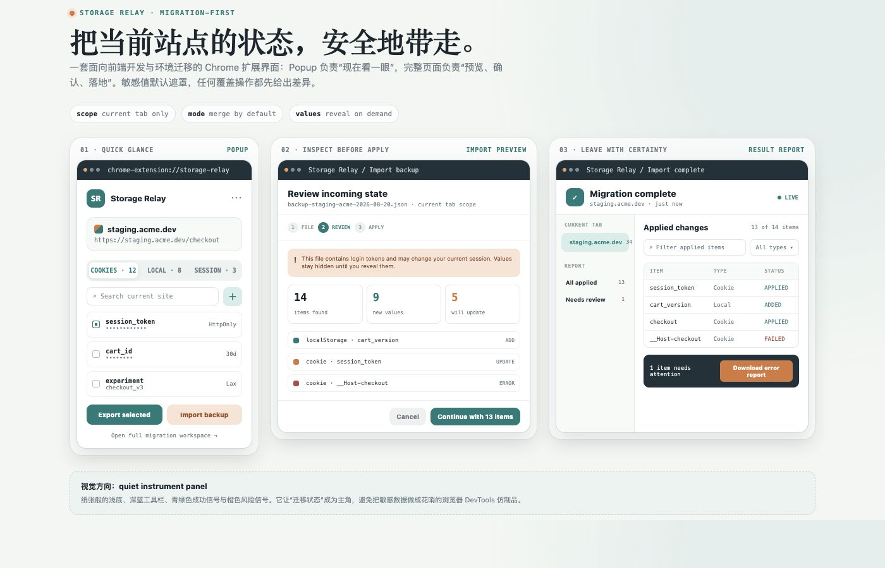
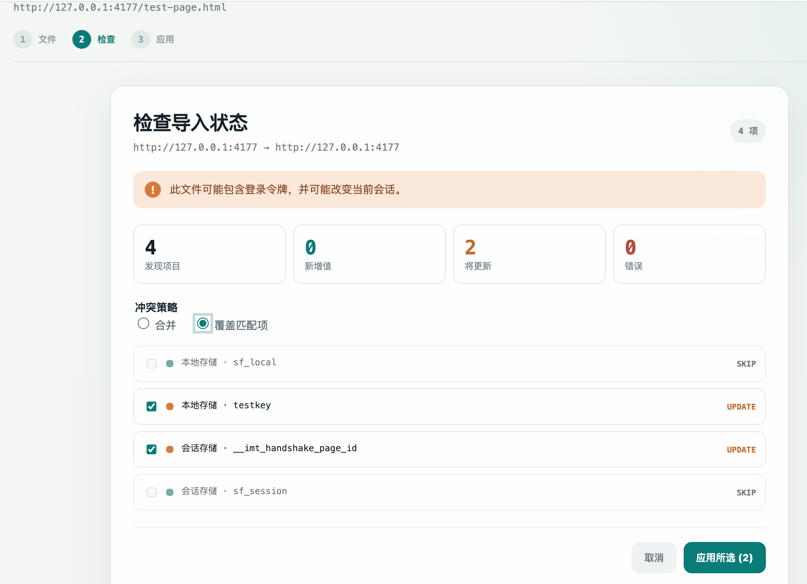
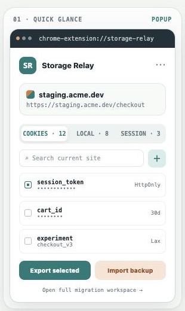
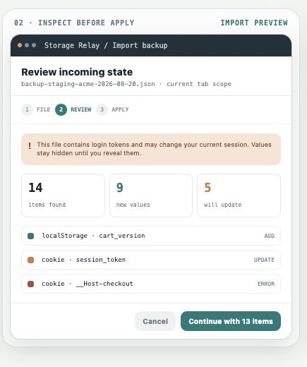
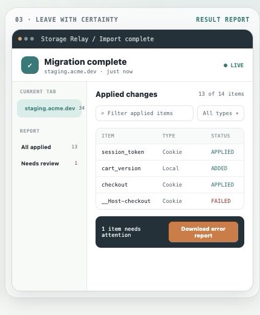

# StateFerry

StateFerry is a Manifest V3 Chrome extension for inspecting, exporting, and importing the storage state of the **current tab only**.

It is designed for frontend developers and QA engineers who need to move a login/session state between local, staging, and production-like environments without maintaining a cross-site inventory.

## Product Preview

The images below show the approved product direction with representative data. They are UI previews, not real browser data.



The following screenshot is from the real local Chrome fixture test. It contains fictional values only.



| Popup | Import review | Result report |
| --- | --- | --- |
|  |  |  |

## Current Status

The release candidate is complete at the source, automated-test, and local Chrome fixture level:

- Current-tab `Cookie`, `localStorage`, and `sessionStorage` snapshotting.
- Popup with tabs, counts, search, masked values, reveal/copy actions, and export actions.
- Add, edit, and delete controls for Cookie, localStorage, and sessionStorage in the current tab.
- Versioned JSON backup format with full-value and redacted exports.
- Migration workspace using `parse -> review -> apply -> report`.
- Merge by default, with an overwrite option for matching items.
- Per-item Add / Update / Skip / Error planning and partial-failure reporting.
- Cookie target mapping and constraint validation for a different environment.
- English, Simplified Chinese, and Traditional Chinese UI fallback based on browser language.
- No install-time `host_permissions`; the manifest requests `activeTab`, `scripting`, `cookies`, and `downloads`, plus optional HTTP/HTTPS origins that are requested only for the current site when Cookie access is enabled.

Automated verification currently covers 57 tests across 11 test files. The local Chrome fixture verified Cookie authorization, masked reveal, copy, add/edit/delete, export, Merge/Overwrite preview, and import apply. The release tooling also audits the built manifest, permissions, locale catalogs, icon dimensions, required files, remote-code references, and source maps.

## Features

### Current tab scope

- Cookies are read for the active page URL.
- `localStorage` is limited to the active page's exact origin.
- `sessionStorage` stays bound to the current tab and origin. It is never merged with another tab.
- The tab URL and origin are checked again before writes. If the tab navigates, the operation stops with `TAB_NAVIGATED`.

### Export

From the Popup or migration workspace, export any combination of:

- Cookies
- Local storage
- Session storage

Sensitive values are masked in the interface by default. Export can include complete values or mark the document as redacted. Plaintext values are not stored in extension history, `chrome.storage`, or logs.

### Import and migration

Import never applies immediately. The workflow is:

1. Parse and validate the JSON file.
2. Review source and target scope plus the item-level diff.
3. Choose Merge or Overwrite matching items.
4. Select compatible items to apply.
5. Review succeeded, skipped, and failed results and optionally download an error report.

Cookie mappings are recalculated by the service worker for the current target URL. Host-only cookies omit the `domain` field when written. Unsupported `__Host-`, `__Secure-`, Secure, SameSite, or partition constraints are reported instead of silently ignored.

## Installation

### Use the prebuilt extension

```bash
npm install
npm run build
```

1. Open `chrome://extensions`.
2. Enable **Developer mode**.
3. Choose **Load unpacked**.
4. Select this repository's `dist/` directory.
5. Open an HTTPS, HTTP, or localhost page and click the StateFerry toolbar icon.

The repository does not commit `dist/`; rebuild after source changes.

### Development commands

```bash
npm test          # run the full Vitest suite
npm run typecheck # run TypeScript without emitting files
npm run build     # create the loadable dist/ extension
npm run release:audit   # inspect the production extension bundle
npm run release:package # build and create release/stateferry-<version>.zip
```

## Permissions and privacy

| Permission | Why it is needed |
| --- | --- |
| `activeTab` | Temporarily access the page after the user opens the extension. |
| `scripting` | Read and write page storage in the current tab. |
| `cookies` | Read and write cookies matching the current page URL after the user enables access. |
| `downloads` | Save backup and error-report files chosen by the user. |

StateFerry does not request all-sites access at install time, run in the background on unrelated tabs, upload backups, or load remote scripts/configuration. Chrome may show a per-site permission prompt when Cookie management is first used. Backup files can contain login tokens; treat them like passwords and remove them when they are no longer needed.

Some Chrome versions may require host access for Cookie API calls even when `activeTab` is present. The extension reports `COOKIE_PERMISSION_DENIED` in that case rather than silently widening its permissions.

## Backup format

Backup files use fixed English machine fields so they remain portable across UI languages:

```json
{
  "schemaVersion": 1,
  "exportedAt": "2026-08-20T06:30:00.000Z",
  "source": {
    "origin": "https://staging.example.com",
    "pageUrl": "https://staging.example.com/checkout"
  },
  "scope": {
    "cookies": "current-url-match",
    "localStorage": "exact-origin",
    "sessionStorage": "current-tab"
  },
  "cookies": [],
  "localStorage": [],
  "sessionStorage": []
}
```

`sessionStorage` values are portable as key/value data, but they are always written into the currently active tab. The source tab is not opened automatically.

## Localization

- English is the default.
- `zh-CN`, `zh-SG`, and other Simplified Chinese variants use Simplified Chinese.
- `zh-TW`, `zh-HK`, and `zh-MO` use Traditional Chinese.
- Other browser languages fall back to English.

Chrome message catalogs live in `public/_locales/en`, `public/_locales/zh_CN`, and `public/_locales/zh_TW`. The runtime locale helper also covers regional browser locales such as `zh-SG` when Chrome returns an English default message.

## Error codes

The runtime uses stable machine-readable codes, including:

`UNSUPPORTED_PAGE`, `TAB_NAVIGATED`, `STORAGE_READ_FAILED`, `SESSION_TAB_UNAVAILABLE`, `INVALID_BACKUP_JSON`, `UNSUPPORTED_SCHEMA_VERSION`, `COOKIE_CONSTRAINT_INVALID`, `COOKIE_PERMISSION_DENIED`, `PARTIAL_APPLY`, `REDACTED_VALUE`, and `DOWNLOAD_FAILED`.

## Manual release checklist

Before publishing a release, load `dist/` in Chrome and verify:

- Empty, small, and large values in all three storage types.
- HTTPS, HTTP, localhost, and a restricted `chrome://` page.
- Reveal and copy actions leave values masked by default after reload.
- Exporting complete and redacted backups.
- Merge, Overwrite, item deselection, and partial failure reporting.
- Navigating or closing the target tab during an operation.
- English, Simplified Chinese, Traditional Chinese, and a non-Chinese browser locale.
- Cookie behavior on the Chrome versions you intend to support.

## Repository layout

```text
src/
├── background/   Service worker, Cookie API, downloads, message routing
├── page-bridge/  Serializable current-tab storage read/write functions
├── core/         Backup schema, diff engine, Cookie rules, locale logic
├── popup/        Quick current-site view
├── migration/    Import, review, apply, and report workspace
└── ui/           Shared formatting and localized UI messages
```

## License

No license has been selected for this repository yet.
